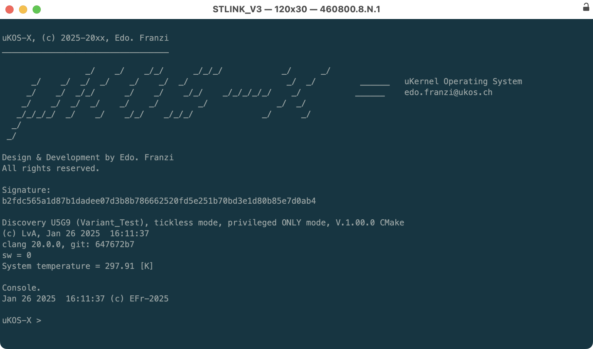
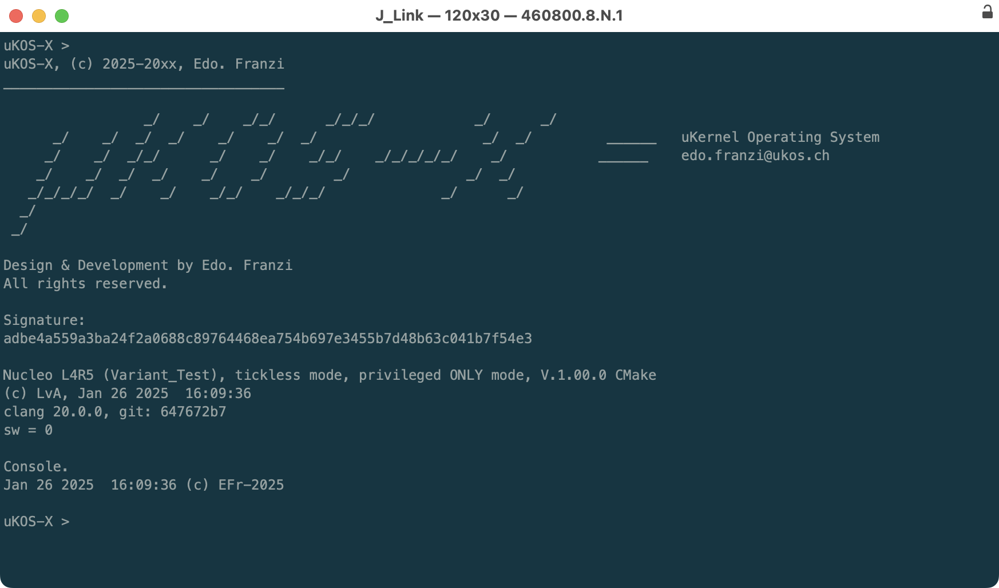

# Testing build with uKOS

To test the toolchain, one use it to build some projects running on hardware boards:

- STM Discovery U5A9
- STM Nucleo L4R5

## Discovery U5A9

The firmware is build in the following way:

```
cd $PATH_UKOS_KERNEL/Ports/Targets/Discovery_U5A9/Variant_Test
cmake -DUSE_LLVM=ON -S . -B build
cmake --build build
```

After programming the board the console shows:



## Nucleo L4R5

The firmware is build in the following way:

```
cd $PATH_UKOS_KERNEL/Ports/Targets/Nucleo_L4R5/Variant_Test
cmake -DUSE_LLVM=ON -S . -B build
cmake --build build
```

After programming the board the console shows:



